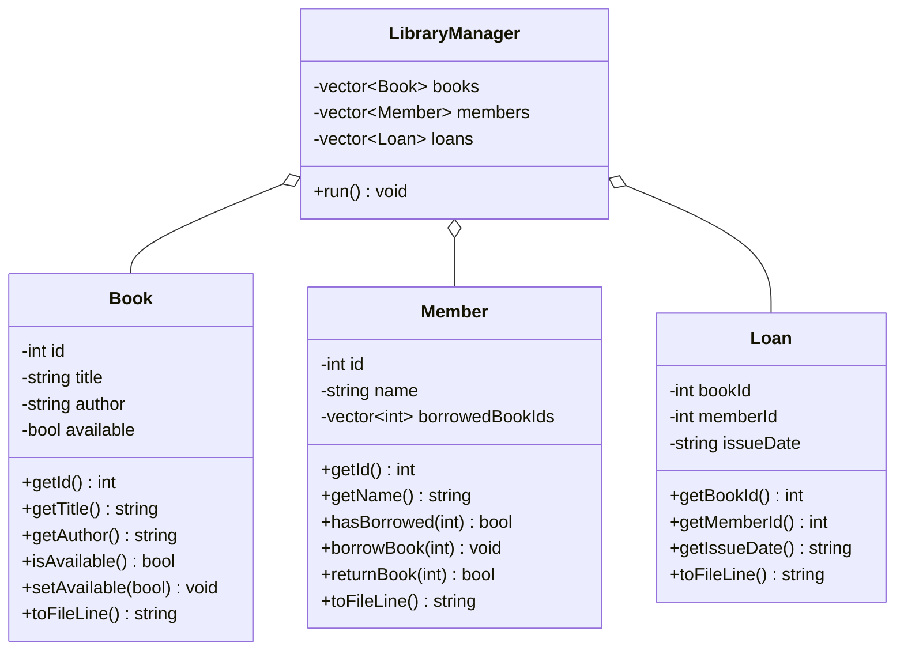

# Class Diagram

```mermaid
classDiagram
    class Book {
        -int id
        -string title
        -string author
        -bool available
        +getId() int
        +getTitle() string
        +getAuthor() string
        +isAvailable() bool
        +setAvailable(bool) void
        +toFileLine() string
    }
    class Member {
        -int id
        -string name
        -vector~int~ borrowedBookIds
        +getId() int
        +getName() string
        +hasBorrowed(int) bool
        +borrowBook(int) void
        +returnBook(int) bool
        +toFileLine() string
    }
    class Loan {
        -int bookId
        -int memberId
        -string issueDate
        +getBookId() int
        +getMemberId() int
        +getIssueDate() string
        +toFileLine() string
    }
    class LibraryManager {
        -vector~Book~ books
        -vector~Member~ members
        -vector~Loan~ loans
        +run() void
    }
    LibraryManager o-- Book
    LibraryManager o-- Member
    LibraryManager o-- Loan
```
